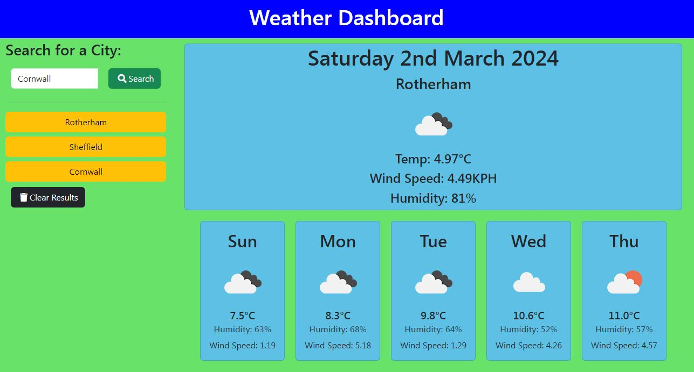
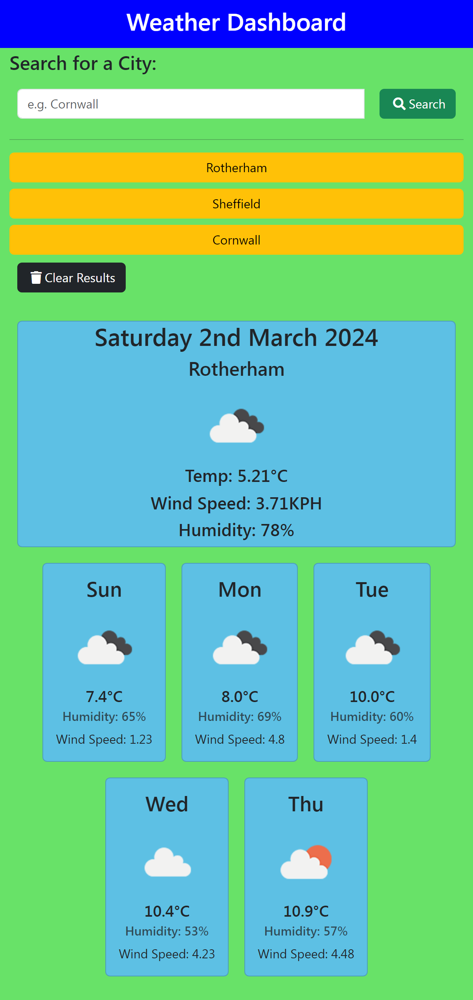

# **5 Day Weather App**

   

  ## Description
  - Find out what the weather is like wherever you want to go for today and the next 5 days. Displays variables like temperature, wind speed, humidity, etc. It saves you searches for you for ease of use.
  
  ## Site Link

  - Try out my 5 Day Weather App here: https://brooksy236.github.io/5-Day-Weather-App

  ## Table of Contents

  - [License](#license)
  - [Installation](#installation-instructions)
  - [Usage](#usage-information)
  - [Contribution](#contribution-guidelines)
  - [Tests](#test-instructions)

  ## Installation Instructions
  - None

  ## Usage Information
  - Open the website, type in a location and hit 'Search'.
  
  ## Screenshots 
  
  

  ## Contribution Guidelines
  - N/A

  ## Test Instructions
  - N/A

  ## License
  - MIT
